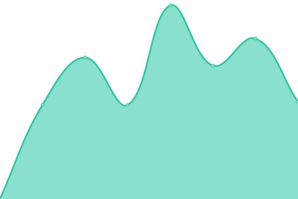
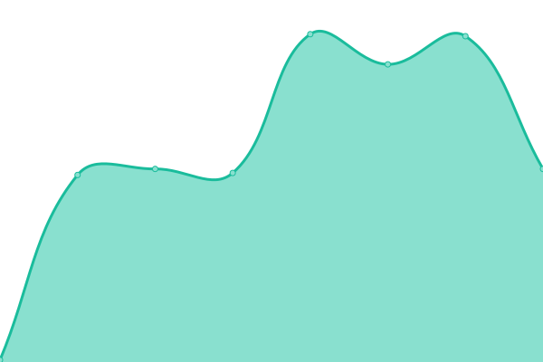

# [📈 Live Status](https://status.greifswald.de): <!--live status--> **🟩 All systems operational**

This repository contains the open-source uptime monitor and status page for [alxhu-dev](alxhu.de), powered by [Upptime](https://github.com/upptime/upptime).

With [Upptime](https://upptime.js.org), you can get your own unlimited and free uptime monitor and status page, powered entirely by a GitHub repository. We use [Issues](https://github.com/alxhu-dev/status.greifswald.lgbt/issues) as incident reports, [Actions](https://github.com/alxhu-dev/status.greifswald.lgbt/actions) as uptime monitors, and [Pages](https://status.greifswald.de) for the status page.

<!--start: status pages-->
<!-- This summary is generated by Upptime (https://github.com/upptime/upptime) -->
<!-- Do not edit this manually, your changes will be overwritten -->
<!-- prettier-ignore -->
| URL | Status | History | Response Time | Uptime |
| --- | ------ | ------- | ------------- | ------ |
|  [greifswald.lgbt (Mastodon, IPv4)](https://greifswald.lgbt) | 🟩 Up | [greifswald-lgbt-mastodon-i-pv4.yml](https://github.com/alxhu-dev/status.greifswald.lgbt/commits/HEAD/history/greifswald-lgbt-mastodon-i-pv4.yml) | 

 892ms
     
 | 

<a href="https://status.greifswald.lgbt/history/greifswald-lgbt-mastodon-i-pv4">100.00%</a>
    

|  [greifswald.lgbt (Mastodon, IPv6)](https://greifswald.lgbt) | 🟩 Up | [greifswald-lgbt-mastodon-i-pv6.yml](https://github.com/alxhu-dev/status.greifswald.lgbt/commits/HEAD/history/greifswald-lgbt-mastodon-i-pv6.yml) | 

 123ms
     
 | 

<a href="https://status.greifswald.lgbt/history/greifswald-lgbt-mastodon-i-pv6">100.00%</a>
    

|  [Pride Greifswald (Website, IPv4)](https://pride-greifswald.de) | 🟩 Up | [pride-greifswald-website-i-pv4.yml](https://github.com/alxhu-dev/status.greifswald.lgbt/commits/HEAD/history/pride-greifswald-website-i-pv4.yml) | 

 1163ms
     
 | 

<a href="https://status.greifswald.lgbt/history/pride-greifswald-website-i-pv4">100.00%</a>
    

|  [Pride Greifswald (Website, IPv6)](https://pride-greifswald.de) | 🟩 Up | [pride-greifswald-website-i-pv6.yml](https://github.com/alxhu-dev/status.greifswald.lgbt/commits/HEAD/history/pride-greifswald-website-i-pv6.yml) | 

 125ms
     
 | 

<a href="https://status.greifswald.lgbt/history/pride-greifswald-website-i-pv6">100.00%</a>
    

<!--end: status pages-->

[**Visit our status website →**](https://status.greifswald.lgbt)

## 📄 License

- Powered by: [Upptime](https://github.com/upptime/upptime)
- Code: [MIT](./LICENSE) © [Anand Chowdhary](https://anandchowdhary.com), supported by [Pabio](https://pabio.com)
- Data in the `./history` directory: [Open Database License](https://opendatacommons.org/licenses/odbl/1-0/)
